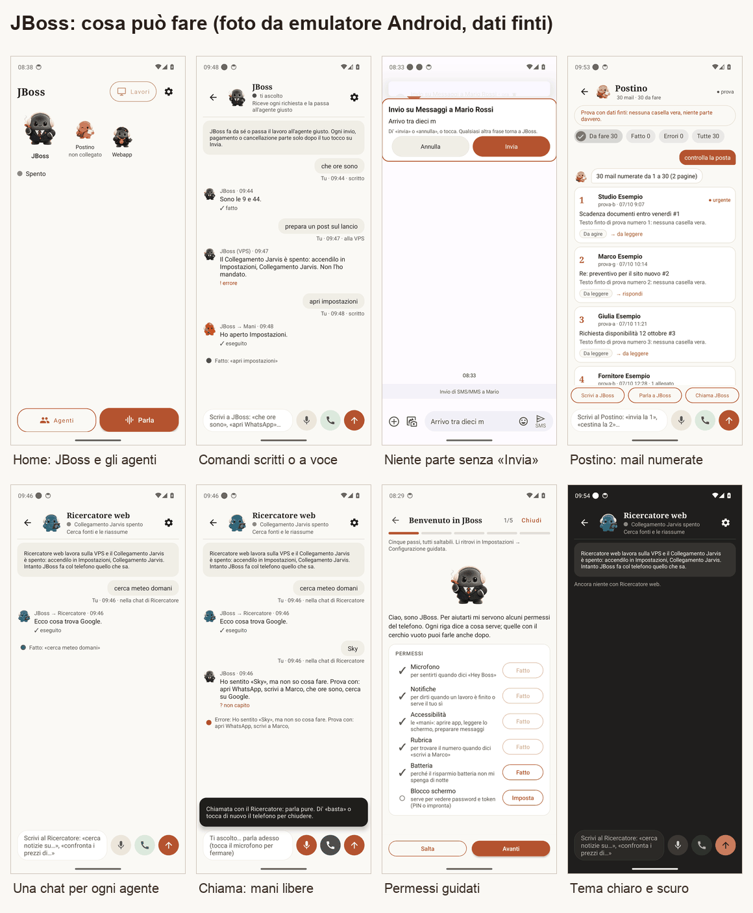
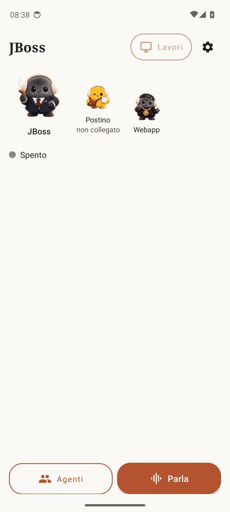
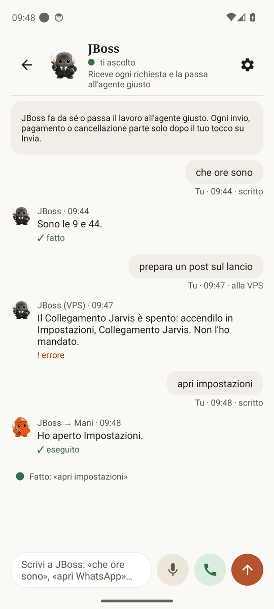
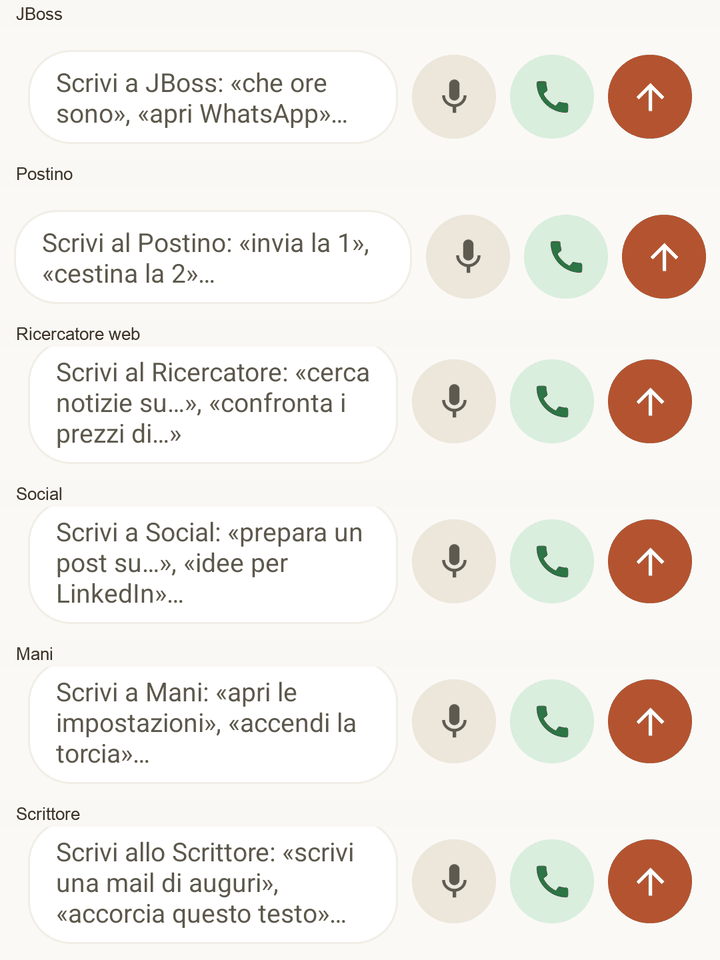
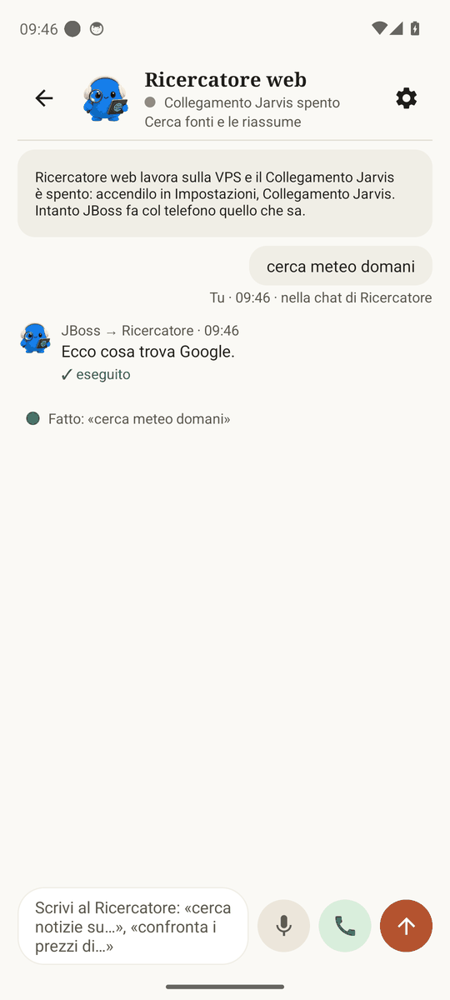
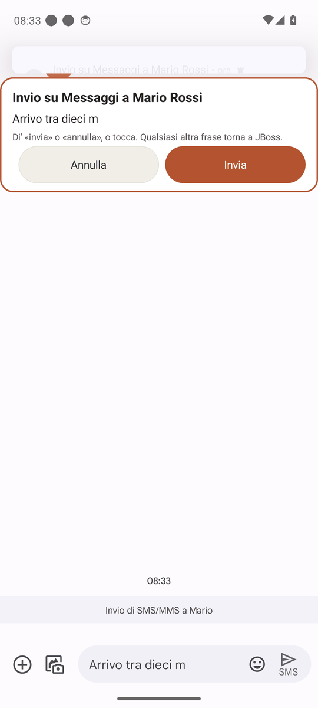
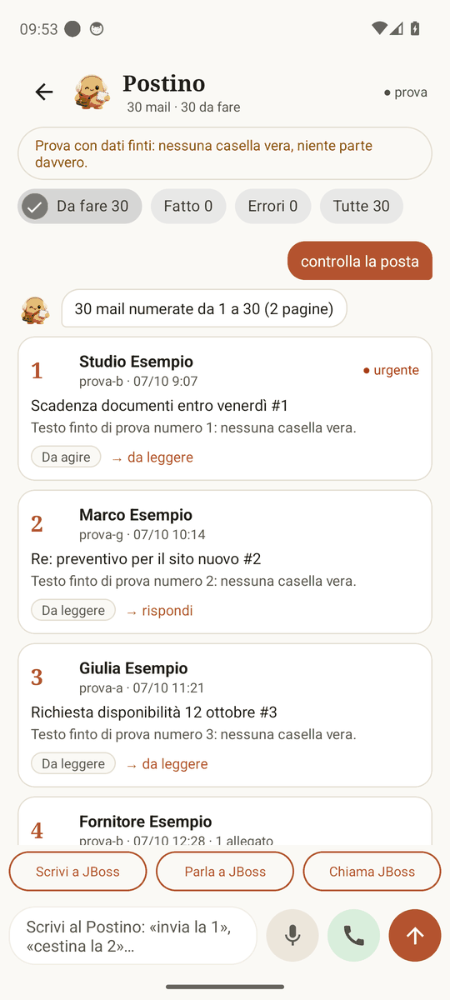
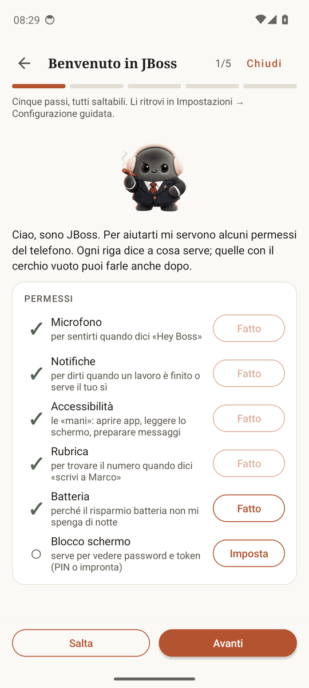
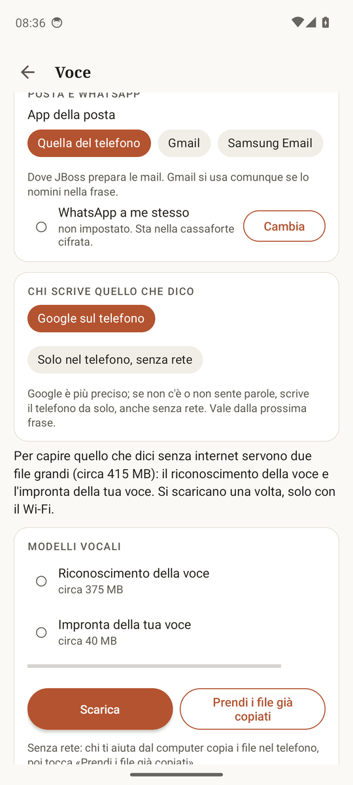
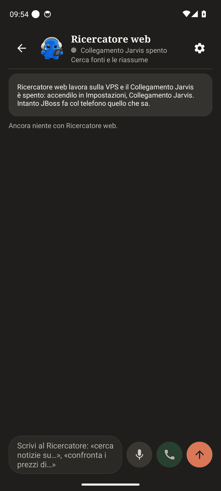

# JBoss

JBoss è un assistente per telefoni Android. Gli parli o gli scrivi, e lui usa le app del telefono al posto tuo:
apre le app, prepara messaggi e mail, chiama, cerca, imposta sveglie, legge l'ora. Ogni messaggio, mail o pagamento
parte solo dopo il tuo tocco su **Invia**.

È gratis, il codice è aperto (licenza GPL-3.0) e non serve nessun account. Funziona tutto sul telefono. Se vuoi,
puoi collegarlo a una VPS (un computer sempre acceso su internet) per i lavori lunghi e per la posta: è facoltativo.

*Tutte le foto di questa pagina vengono da un emulatore Android (Pixel con Android 14 e un telefono senza servizi
Google con Android 9), con dati finti. Non sono foto di un telefono fisico.*

## Cosa fa

| | |
|---|---|
|  | **Home.** JBoss è il capo: gli parli tu, lui passa il lavoro all'agente giusto (Postino per la posta, Ricercatore, Social, Mani, Scrittore). Il tasto **Parla** lo fa ascoltare subito; puoi anche dire «Hey Boss». |
|  | **Comandi scritti o a voce.** «che ore sono», «apri impostazioni», «manda un SMS a Mario che arrivo»: ogni riga dice cosa ha fatto. Questa chat è anche la cronologia. |
|  | **La stessa barra in ogni chat** (JBoss, Postino, Ricercatore, Social, Mani, Scrittore), come nella webapp Jarvis: il campo con gli esempi di quell'agente, 🎤 **Parla** (detti e parte), 📞 **Chiama** (conversazione a mani libere: di' «basta» per chiudere), ↑ **Invia**. |
|  | **Una chat per ogni agente**, con avatar, missione, stato e cronologia della conversazione. Se un agente ha bisogno della VPS e non c'è, lo dice in chiaro. |
|  | **Niente parte senza di te.** Per ogni messaggio JBoss prepara la bozza nell'app giusta e mostra solo **Annulla** e **Invia**. Se non tocchi niente, dopo 2 minuti la bozza scade. |
|  | **Postino** (con la VPS). Le mail arrivano numerate; dici «cestina 3, 5-9» o «rispondi 4: grazie». Una sola conferma per ogni invio o cancellazione. Tre pulsanti riportano a JBoss: Scrivi, Parla, Chiama. |
|  | **Permessi guidati.** Al primo avvio una pagina spiega ogni permesso e porta alla schermata giusta di Android. Tutti i passi si possono saltare. |
|  | **Voce e posta.** Scegli chi trascrive (Google o il telefono senza rete) e quale app di posta usare: di base quella predefinita del tuo telefono. |
|  | **Tema chiaro e scuro**, come il telefono. |

Altre foto: [impostazioni](docs/img/impostazioni.png), [agenti](docs/img/agenti.png),
[prova guidata con i primi comandi](docs/img/prova-guidata-comandi.png), [guida batteria](docs/img/guida-batteria.png),
[collegamento VPS](docs/img/collegamento-jarvis-vps.png), [lavori sulla VPS](docs/img/lavori-vps.png),
[conferma del Postino](docs/img/postino-conferma-invio.png), [telefono senza Google](docs/img/android9-senza-google.png),
[agente Social](docs/img/agente-social.png), [agente Mani](docs/img/agente-mani.png), [agente Scrittore](docs/img/agente-scrittore.png),
[Parla in ascolto](docs/img/barra-parla.png), [chat in orizzontale](docs/img/chat-orizzontale.png).

L'elenco dei comandi con esempi è nella [guida per l'uso](docs/GUIDA-UTENTE.md).

## Cosa serve

- Un telefono Android 8.0 o più recente. Provato su Samsung (Galaxy S24, telefono vero), su Pixel con Android 14 e
  su un telefono senza servizi Google con Android 9 (tutti e due su emulatore). Le altre marche dovrebbero
  funzionare: la tabella onesta è in [COMPATIBILITA.md](docs/COMPATIBILITA.md).
- Circa 50 MB per l'app (APK per telefoni a 64 bit). Se vuoi la voce anche senza internet, altri 415 MB che l'app
  scarica una volta, solo col Wi-Fi.
- Nessun account. Google non è obbligatorio: senza i servizi Google la voce usa il riconoscimento del telefono e il
  codice QR si sostituisce con «Incolla».

### I permessi e perché

| Permesso | A cosa serve | Se non lo dai |
|---|---|---|
| Microfono | sentire «Hey Boss» e i comandi a voce | scrivi i comandi |
| Notifiche | dirti quando un lavoro è finito o serve il tuo sì | non vedi gli avvisi ad app chiusa |
| Accessibilità | le «mani»: aprire app, leggere lo schermo, preparare messaggi, mostrare Invia/Annulla | JBoss risponde ma non usa le app |
| Rubrica | trovare il numero quando dici «scrivi a Marco» | devi dire il numero |
| Batteria (esclusione) | non farsi spegnere di notte dal risparmio energetico | «Hey Boss» smette di rispondere dopo un po' |
| Blocco schermo | proteggere password e token salvati nell'app | non vedi i segreti salvati |

## Come si installa

1. Scarica l'APK dalla pagina **Releases** del repository. Per quasi tutti i telefoni va bene il file
   `arm64-v8a`. Il file `universal` va su tutti i telefoni ma pesa di più (circa 100 MB).
2. Apri il file dal telefono. Android chiede di consentire l'installazione da quella fonte (Chrome, File o
   l'app da cui lo apri): consenti una volta, poi torna indietro e tocca **Installa**.
3. Apri JBoss. Parte la configurazione guidata, cinque passi:
   - **Permessi.** Tocca ogni riga. Per l'accessibilità la guida dice cosa premere sulla tua marca. Se
     l'interruttore è grigio («Impostazione con restrizioni»): Informazioni app → tre puntini in alto → «Consenti
     impostazioni con restrizioni», poi riprova. Android lo chiede a tutte le app installate da un file.
   - **Batteria.** Tocca «Guida →»: c'è il passo per Samsung, Pixel, Xiaomi, OnePlus, Motorola e altre marche,
     con il link alla pagina della tua marca su dontkillmyapp.com.
   - **Modelli vocali** (facoltativi): la voce senza rete.
   - **Cervello**: la VPS o una chiave API (facoltativi, servono solo per le frasi che le regole non capiscono).
   - **Prova guidata**: tre frasi per vedere che funziona.
4. In Impostazioni → Voce accendi «Ascolta Hey Boss sempre» se vuoi la parola di attivazione.

Problemi frequenti, marca per marca: [GUIDA-UTENTE.md](docs/GUIDA-UTENTE.md#problemi-frequenti).

## Quanto costa

Niente. L'app è gratis e non ha pubblicità. Costano soltanto, se li scegli tu: una VPS (vedi sotto) e un abbonamento
o una chiave di un servizio di intelligenza artificiale per il «cervello» delle frasi difficili.

## La VPS (facoltativa)

Senza VPS JBoss fa tutto quello che si vede sopra, tranne il Postino e i lavori lunghi. Con una VPS su cui gira
Jarvis (il progetto per computer, distribuito a parte) aggiungi: lettura e ordine della posta, ricerche lunghe, un
cervello per le frasi difficili, la memoria condivisa con la webapp Jarvis sul computer.

Come prenderla e collegarla: [GUIDA-VPS.md](docs/GUIDA-VPS.md). Il link per comprare la VPS è un link di
affiliazione: se lo usi, chi ha scritto JBoss riceve una commissione e per te il prezzo non cambia. Link:
<!--VPS-->https://www.hostinger.com/it/prezzi?REFERRALCODE=ITALOMARZIANO<!--/VPS-->

## Privacy: cosa resta sul telefono

- I comandi, la cronologia e le preferenze restano nel telefono. Senza VPS l'app non manda niente a nessun server
  di JBoss (non ne esiste uno).
- Password e token che salvi stanno in una cassaforte cifrata (chiave nel chip sicuro del telefono). Niente backup
  nel cloud.
- Se usi il riconoscimento vocale di Google, l'audio della frase lo tratta Google come per la tastiera vocale. Con la
  voce «solo nel telefono» l'audio non esce dal telefono.
- I modelli della voce si scaricano da GitHub (progetto sherpa-onnx), solo se lo chiedi.
- Con la VPS i lavori e la posta passano dalla TUA VPS, non da server di altri.

## Licenza

Il codice di JBoss è sotto **GNU GPL versione 3** (file [LICENSE](LICENSE)). In pratica: puoi usarlo, studiarlo,
modificarlo e ridistribuirlo. Se ridistribuisci l'app o una versione modificata, deve restare GPL-3.0 e devi dare
anche il codice sorgente. La GPL non vieta di vendere copie: vieta di togliere queste libertà a chi le riceve.

JBoss è il nome di questa app Android, non è affiliata a Red Hat né al server applicativo JBoss.

In fondo al file LICENSE c'è un permesso aggiuntivo (GPLv3, sezione 7) che consente di distribuire JBoss insieme alle
librerie di Google Play services, ML Kit e Firebase, che non sono libere. I componenti di altri (librerie, modelli,
immagini) hanno le loro licenze, elencate in [NOTICE](NOTICE) e in Impostazioni → Informazioni · Licenze.

## Per chi sviluppa

- Compilare: JDK 17 e Android SDK 34. `./gradlew :app:assembleRelease` produce un APK per architettura e uno
  universale in `app/build/outputs/apk/release/`. Per firmare: `JBOSS_KEYSTORE_PROPERTIES=/percorso/keystore.properties` (tenuto fuori dal repo).
- Prove sulla JVM: `bash prove.sh` (716 prove, nessun telefono).
- Note tecniche: [docs/LEGGIMI.md](docs/LEGGIMI.md), protocolli e checklist in `docs/`.
- Segnalare un problema: usa il modello «Problema su un telefono» nelle Issue. `bash scripts/info-telefono.sh`
  raccoglie marca, modello e versioni senza dati personali.
